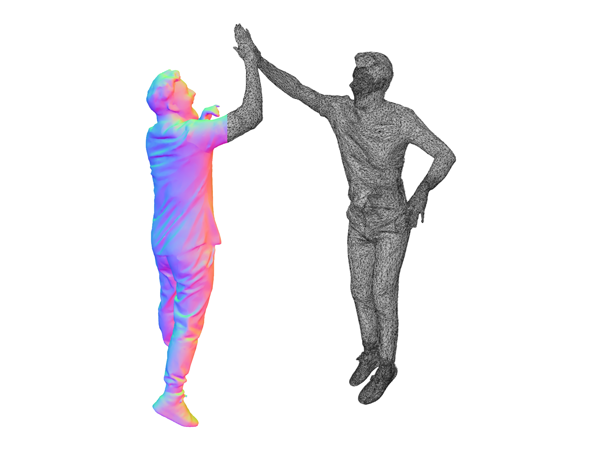

[](https://github.com/psf/black)

# [](https://github.com/eth-ait/aitviewer)
A set of tools to visualize and interact with sequences of 3D data with cross-platform support on Windows, Linux, and macOS. See the official page at [https://eth-ait.github.io/aitviewer](https://eth-ait.github.io/aitviewer/) for all the details.

## Installation
Basic Installation:
```commandline
pip install aitviewer
```
Note that this does not install the GPU-version of PyTorch automatically. If your environment already contains it, you should be good to go, otherwise install it manually.

Or install locally (if you need to extend or modify code)
```commandline
git clone git@github.com:eth-ait/aitviewer.git
cd aitviewer
pip install -e .
```

For more advanced installation and for installing SMPL body models, please refer to the [documentation](https://eth-ait.github.io/aitviewer/parametric_human_models/supported_models.html) .

## Features
* Native Python interface, easy to use and hack.
* Load [SMPL[-H/-X]](https://smpl.is.tue.mpg.de/) / [MANO](https://mano.is.tue.mpg.de/) / [FLAME](https://flame.is.tue.mpg.de/) / [STAR](https://github.com/ahmedosman/STAR) sequences and display them in an interactive viewer.
* Headless mode for server rendering of videos/images.
* Remote mode for non-blocking integration of visualization code.
* Render 3D data on top of images via weak-perspective or OpenCV camera models.
* Animatable camera paths.
* Edit SMPL sequences and poses manually.
* Prebuilt renderable primitives (cylinders, spheres, point clouds, etc).
* Built-in extensible GUI (based on Dear ImGui).
* Export screenshots, videos and turntable views (as mp4/gif)
* High-Performance ModernGL-based rendering pipeline (running at 100fps+ on most laptops).


## Quickstart
Display an SMPL T-pose (Requires SMPL models):
```py
from aitviewer.renderables.smpl import SMPLSequence
from aitviewer.viewer import Viewer

if __name__ == '__main__':
    v = Viewer()
    v.scene.add(SMPLSequence.t_pose())
    v.run()
```


## Projects using the aitviewer
A sampling of projects using the aitviewer. Let us know if you want to add you!
- Dong et al., [Shape-aware Multi-Person Pose Estimation from Multi-view Images](https://ait.ethz.ch/projects/2021/multi-human-pose/), ICCV 2021
- Kaufmann et al., [EM-POSE: 3D Human Pose Estimation from Sparse Electromagnetic Trackers](https://ait.ethz.ch/projects/2021/em-pose/), ICCV 2021
- Vechev et al., [Computational Design of Kinesthetic Garments](https://ait.ethz.ch/projects/2022/cdkg/), Eurographics 2021
- Guo et al., [Human Performance Capture from Monocular Video in the Wild](https://ait.ethz.ch/projects/2021/human-performance-capture/index.php), 3DV 2021
- Dong and Guo et al., [PINA: Learning a Personalized Implicit Neural Avatar from a Single RGB-D Video Sequence](https://zj-dong.github.io/pina/), CVPR 2022

## Citation
If you use this software, please cite it as below.
```commandline
@software{Kaufmann_Vechev_aitviewer_2022,
  author = {Kaufmann, Manuel and Vechev, Velko and Mylonopoulos, Dario},
  doi = {10.5281/zenodo.1234},
  month = {7},
  title = {{aitviewer}},
  url = {https://github.com/eth-ait/aitviewer},
  year = {2022}
}
```

## Contact & Contributions
This software was developed by [Manuel Kaufmann](mailto:manuel.kaufmann@inf.ethz.ch), [Velko Vechev](mailto:velko.vechev@inf.ethz.ch) and Dario Mylonopoulos.
For questions please create an issue.
We welcome and encourage module and feature contributions from the community.


