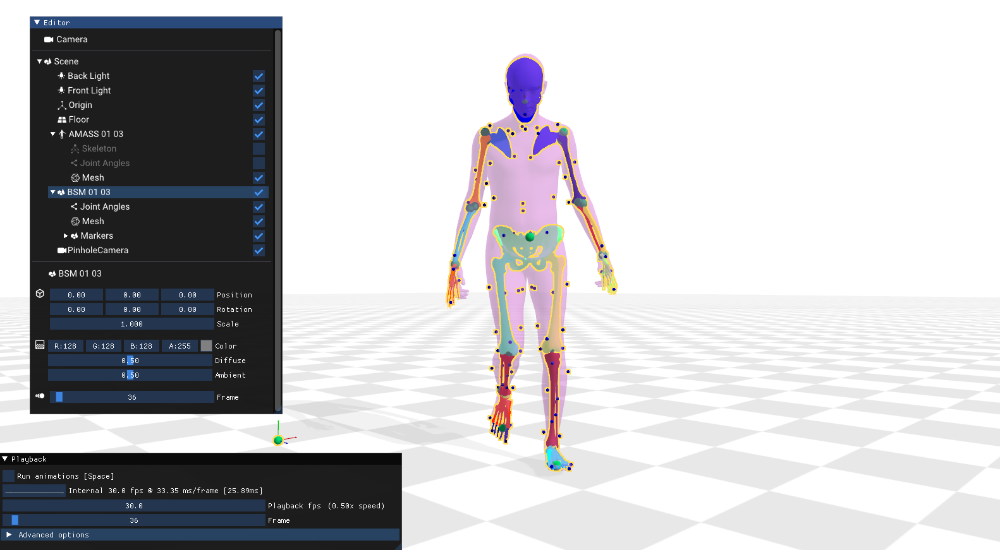
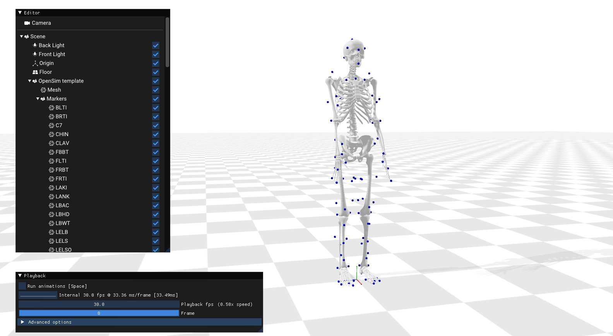

# aitviewer - SKEL

This fork of AitViewer enables the vizualization of Marker sequences, OpenSim models sequences, the BSM model and the SKEL model.
For more info on those model, check our [project page](https://skel.is.tue.mpg.de).

aitviewer is a set of tools to visualize and interact with sequences of 3D data with cross-platform support on Windows, Linux, and macOS. See the official page at [https://eth-ait.github.io/aitviewer](https://eth-ait.github.io/aitviewer/) for all the details.



## Installation

Please refer to the [aitviewer instructions](https://eth-ait.github.io/aitviewer/frontend.html#configure-the-viewer) to set up the paths to SMPLX and AMASS. 

## BSM model

You can download bsm.osim from the dowload page at [https://skel.is.tue.mpg.de](https://skel.is.tue.mpg.de). Then run:

```python load_osim.py --osim /path/to/bsm.osim```

You can find motion sequences in the BioAmass dataset at [https://skel.is.tue.mpg.de](https://skel.is.tue.mpg.de).

To visualize an OpenSim motion sequence:

```python load_osim.py --osim /path/to/bsm.osim --mot /path/to/trial.mot```



## SKEL model

(Coming soon)

## BioAmass Dataset

First download the models and dataset from [https://skel.is.tue.mpg.de](https://skel.is.tue.mpg.de) 
To visualize a sequence from the BioAmass dataset, in `aitconfig.yaml` set the following paths:

```
osim_geometry : /path/to/skel_models_v1.0/Geometry
bioamass : /path/to/bioamass_v1.0
```

Then run:

```
cd examples
python load_bioamass.py
```

## Mocap data
    
We enable loading .c3d and .trc motion capture data. Sample CMU mocap data can be downloaded at http://mocap.cs.cmu.edu/subjects.php.  Set the path to the mocap data folder in `aitvconfig.yaml` in `datasets.mocap`.

To visualize an example mocap sequence, run:

```python load_markers.py```

 


## Citation
If you use this software, please cite the following work and software:

```
@inproceedings{keller2023skel,
  title = {From Skin to Skeleton: Towards Biomechanically Accurate 3D Digital Humans},
  author = {Keller, Marilyn and Werling, Keenon and Shin, Soyong and Delp, Scott and Pujades, Sergi 
            and C. Karen, Liu and Black, Michael J.},
  booktitle = {ACM ToG, Proc.~SIGGRAPH Asia},
  month = dec,
  year = {2023},
}
```

```
@software{Kaufmann_Vechev_aitviewer_2022,
  author = {Kaufmann, Manuel and Vechev, Velko and Mylonopoulos, Dario},
  doi = {10.5281/zenodo.10013305},
  month = {7},
  title = {{aitviewer}},
  url = {https://github.com/eth-ait/aitviewer},
  year = {2022}
}
```

## Licencing

For use of SKEL and BSM, please refer to our project page https://skel.is.tue.mpg.de/license.html.

## Contact 

For any question on the OpenSim model or SKEL loading, please contact skel@tuebingen.mpg.de.

For commercial licensing, please contact ps-licensing@tue.mpg.de