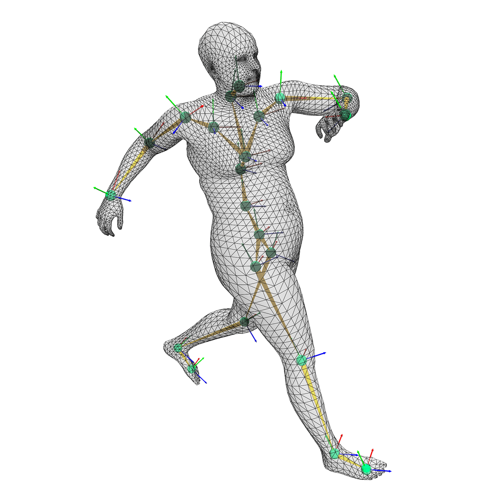
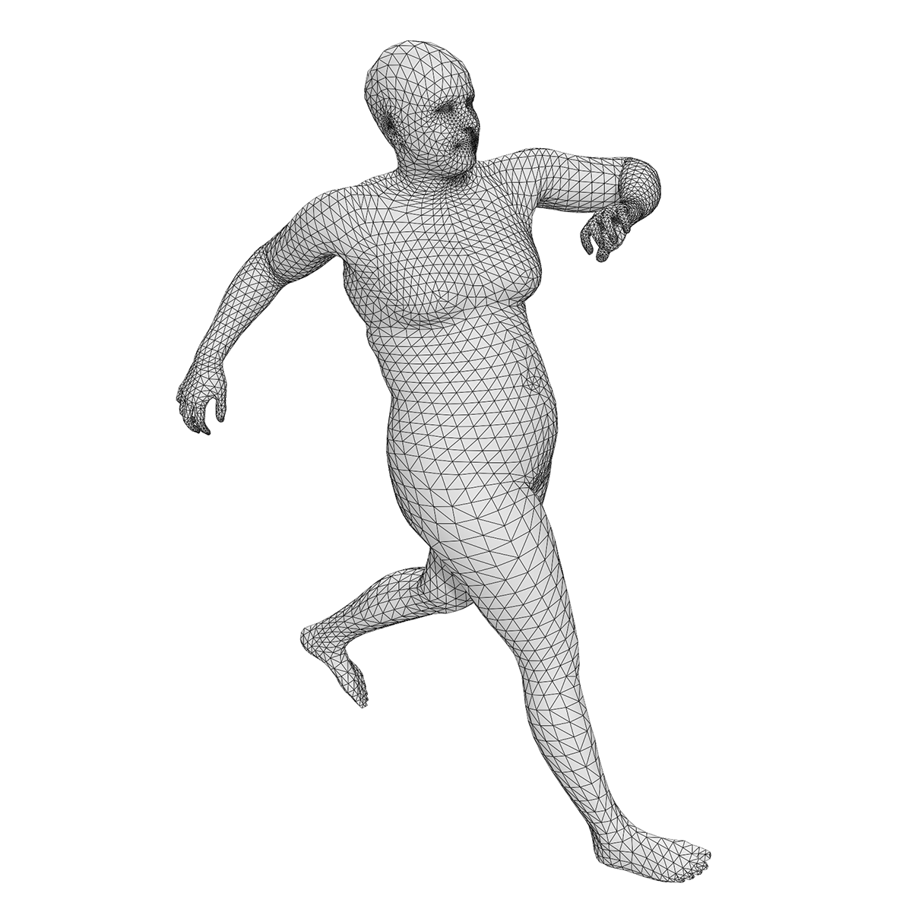
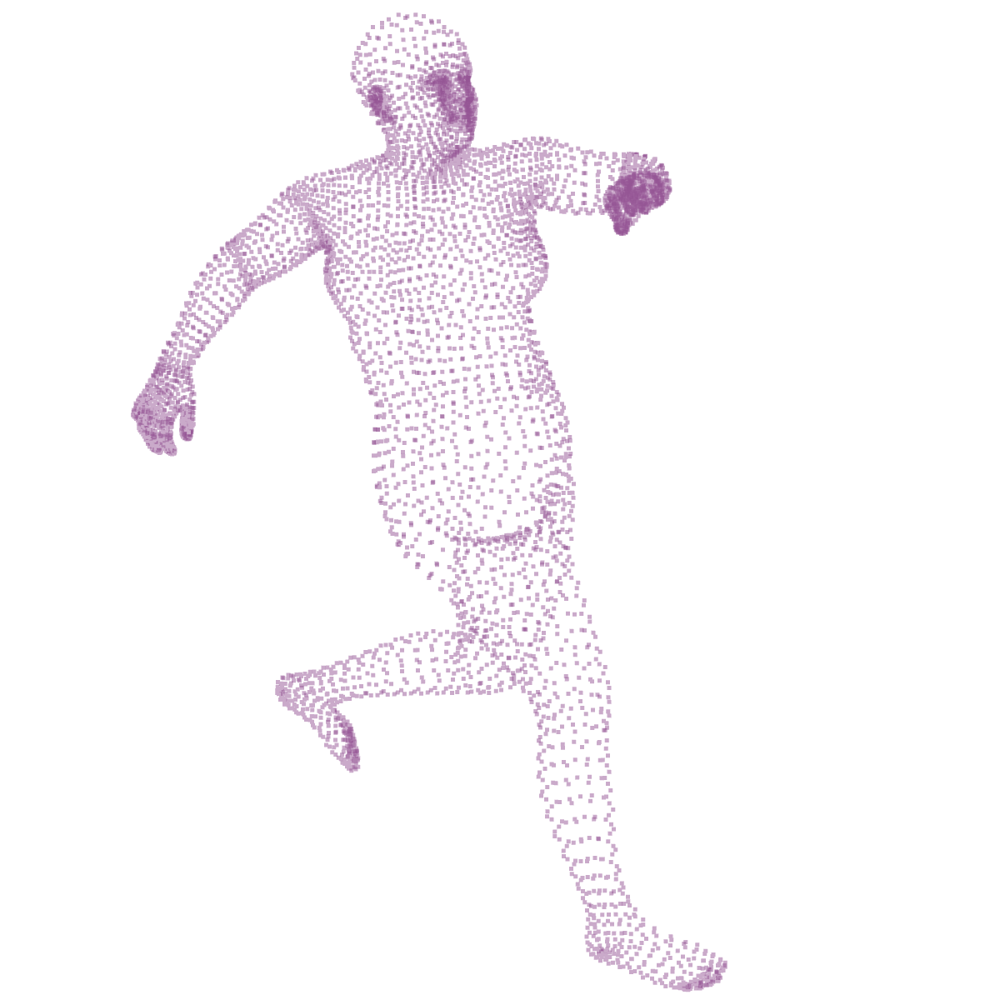
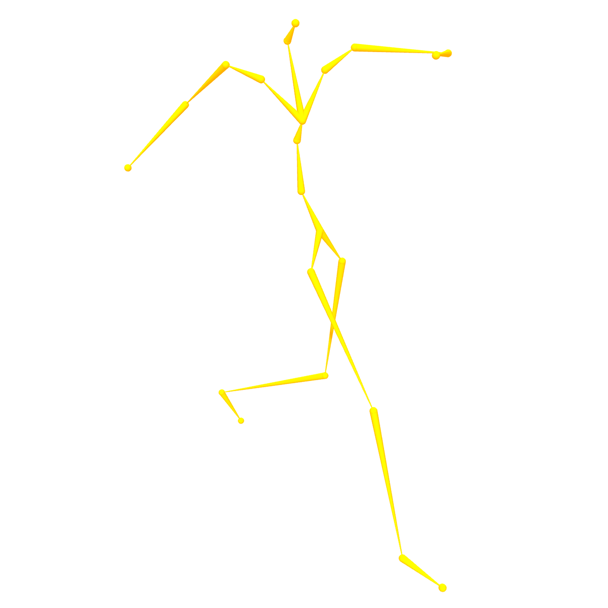
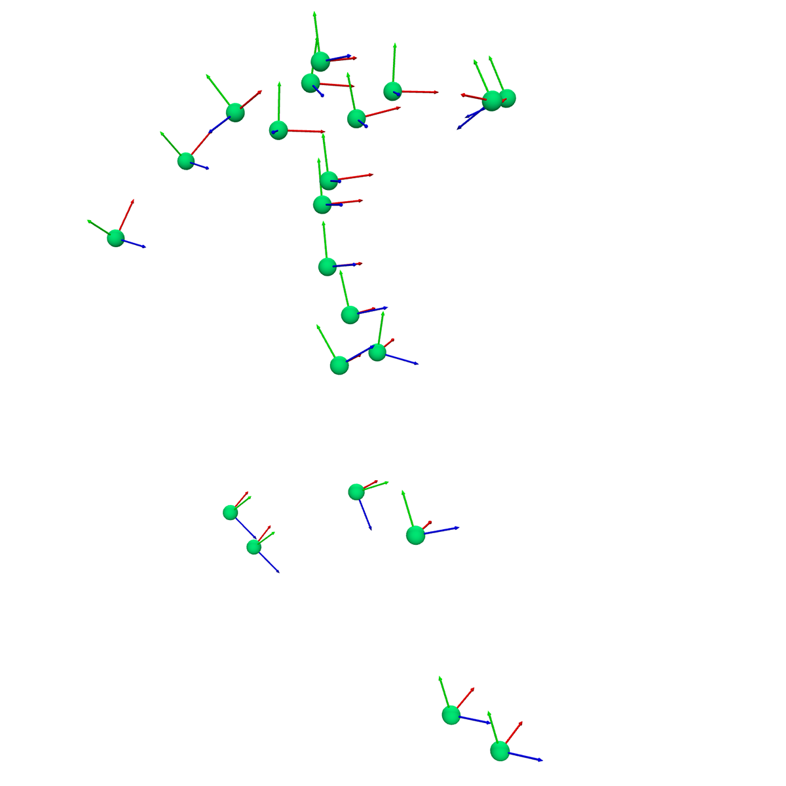
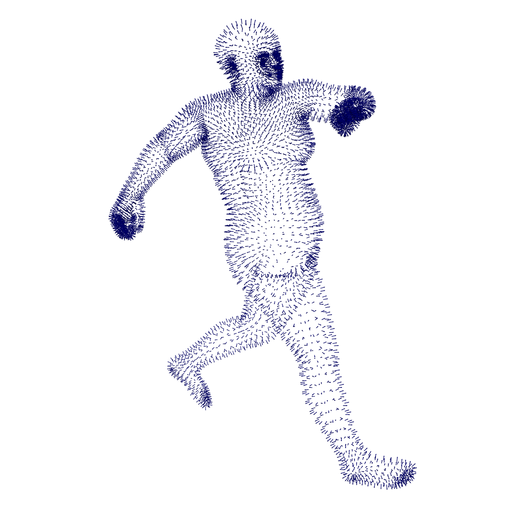
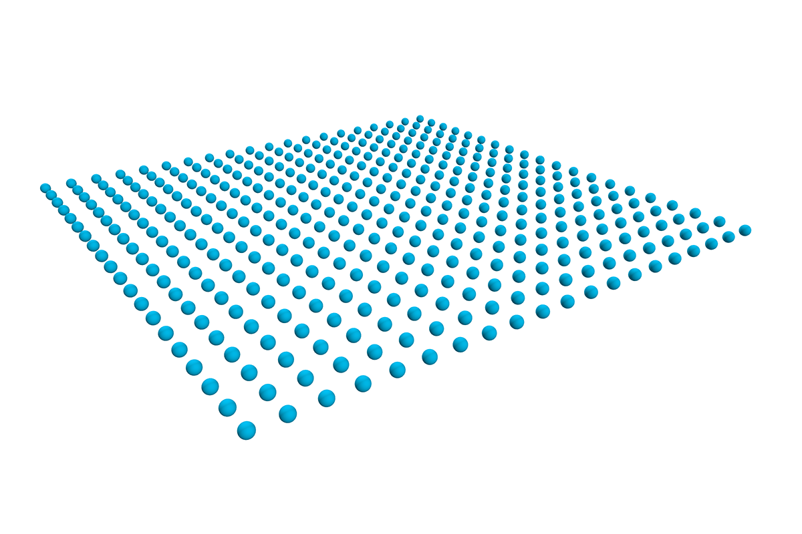
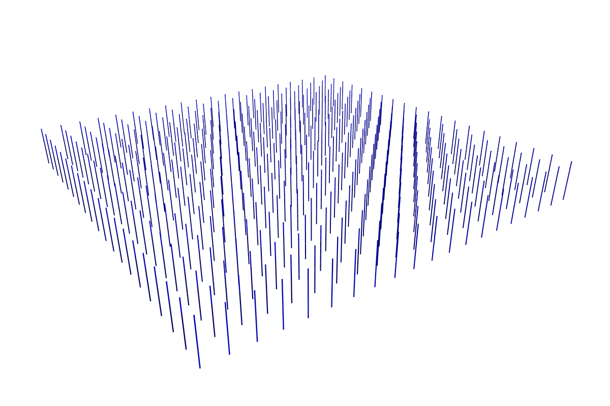

# Renderables
We support a number of renderable components out-of-the box. 
All renderables support an additional batch dimension which is used to support animation. 
A renderable typically consists of some geometry (such as a Mesh), but it can also be nested to contain other renderables.
 
## List of Renderables

| [ *SMPL/STAR Sequences*](renderables/smpl_sequences) | [ *Meshes*](renderables/meshes)| [ *Point Clouds*](renderables/point_clouds) 
| [ *Skeletons*](renderables/skeletons) | [ *Rigid Bodies*](renderables/rigid_bodies) | [ *Billboards*](renderables/billboards)
| [ *Arrows*](renderables/arrows) | [ *Spheres*](renderables/spheres) | [ *Lines*](renderables/lines) | 

## _Base Renderables_ vs. _Composite Renderables_

_Base Renderables_ such as `Spheres`, `Lines`, and `Meshes` implement their own custom shaders and do not rely on any other renderables to 'do their work'. In contrast, _Composite Renderables_ such as `Rigid Bodies` and `SMPL/STAR Sequences` use _Base Renderables_ as children to do their rendering work. _Base Renderables_ support instanced rendering, allowing for higher performance when displaying tens or hundreds of thousands of identical geometries in different affine configurations. 

## Making a Custom Renderables
Add GUI Elements
Add Custom Interaction Modes
Composition vs Inheritance Approaches

