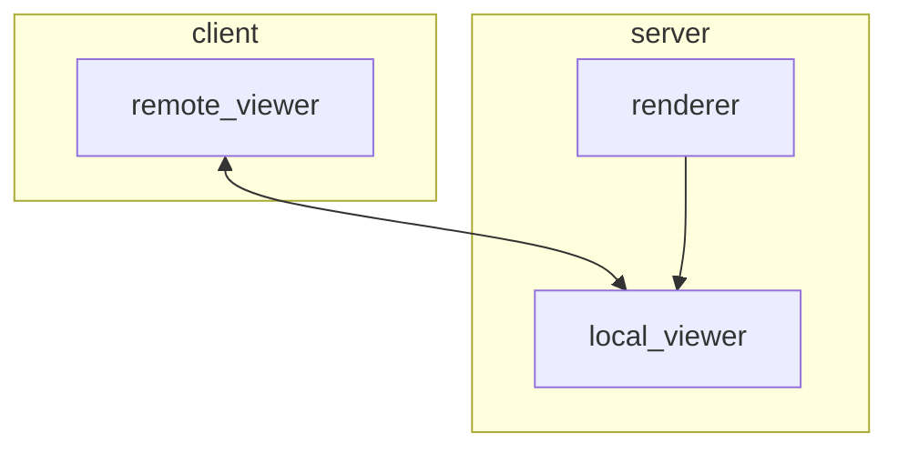

# Technical Details
Details describing the implementation of the viewer will be added here. Example flowchart using Mermaid.

```mermaid
flowchart TB
    remote_viewer<-->local_viewer
    subgraph server
    renderer --> local_viewer
    end
    subgraph client
    remote_viewer
    end

```

